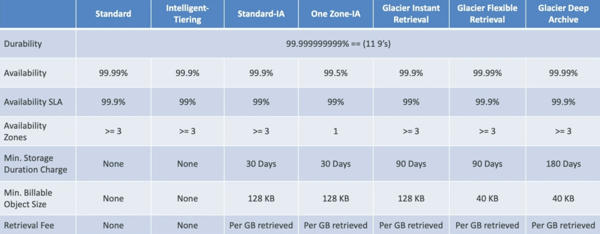

# S3
Infinitely scalable storage.

Buckets are defined at the region level but the names have to be globally unique.
The name of a bucket must follow these conventions:
- No uppercase or underscores
- Between 3-63 characters
- Not an IP address
- Must begin with letter or number
- Cannot start with the following prefixes: `xn--`, `sthree-`, `sthree-configurator-`
- Cannot end with the following suffixes: `-s3alias`, `--ol-s3`

Buckets do not store objects in directories, but you can give the objects names that look like paths to give the impression of directories e.g. `top-folder/sub-folder/file.txt`.

Pay for data transferred out to the Internet or to EC2s in a Region different to the S3 bucket.

Maximum file size is 5TB. If you are uploading an object of 5GB or more, it must use multi-part upload.

You can create static websites from your buckets and the objects inside them by providing an `index.html` file to act as the home page.

Requester Pays - generally, the bucket owner will pay for transfers out of the bucket. However, you can create specific "requester pays" buckets where the cost of the transfer is billed to an authenticated AWS user who has requested your data.

Event Notifications - used to deliver notifications to other AWS services such as EventBridge, SNS, SQS, or Lambda when operations occur within a bucket. Must have enabled the appropriate IAM permissions on the resource you are sending notifications to so that your S3 bucket is allowed to invoke actions on those resources. EventBridge has a lot of additional features that the other named services do not.

## Versioning
Allowing versioning on your bucket allows you to protect your objects against accidental deletion/modification.
Objects in the bucket prior to versioning are given the version `null`.
Disabling versioning does not remove the previous versions of files.

## Security
All objects have an object URL but this is not necessarily accessible by everyone. You can generate pre-signed URLs for your objects which consist of the object URL as well as a second longer part that encodes credentials to access the object.
Objects in private buckets are not viewable by the public. Must configure public access settings and create a public access policy to determine what public users can(not) access on your bucket. Policies can be used to give object access to the public/other AWS accounts and can also specify whether you objects should be encrypted upon upload.

Policies are set with:
- SID - statement ID to identify the policy
- Principal - who the policy applies to
- Action - the action the policy is allowing/forbidding
- Effect - allow/deny
- Resource - which S3 bucket this policy applies to

Object locks are useful for making sure that objects are retained and cannot be deleted to maintain records for future audits.
Vault locks are handy if you want to create policies that cannot be edited after creation i.e. Write Once Read Many (WORM).

Can also block public access for *all* S3 buckets at an account level.
#### Encryption
Encryption in-transit falls under the responsibility of the user. However, there is a default encryption option that is enabled by default on their buckets.
Encryption can be enforced prior to default encryption is used by creating bucket policies that require specific encryption headers in requests to your bucket.

There are 4 types of encryption methods available for S3 provided by AWS:
##### Server-side encryption
- Amazon S3-managed keys - uses keys handled and managed by AWS
	- Enabled for new buckets/objects by default.
- KMS keys - uses the AWS KMS service to manage keys in AWS
	- Get more user control and audit capability using CloudTrail to monitor key usage.
	- Not great for buckets with high throughput as uploads/downloads contribute will always call the KMS API and will contribute to the KMS quota (the quota varies by region but can be increased via the Service Quotas console).
	- Using the default S3 KMS key doesn't cost you anything but having your own KMS keys will incur a monthly cost.
- Double-layer encryption using KMS - stronger, more expensive form of KMS encryption.
	- Does not support the default S3 bucket key.
- Customer-provided keys - for when you want to manage your own encryption keys
	- AWS does *not* store the key used for encryption/decryption.
	- HTTPS *must* be used as the user has to provide the key in the request header every time.
##### Client-side encryption
Client will only upload pre-encrypted data to AWS and will have to decrypt data themselves when downloading data.
The encryption/decryption cycle is fully managed by the client.
##### Encryption in transit (SSL/TLS)
It is recommended that you expose HTTPS endpoints from S3 rather than HTTP so that unencrypted data cannot be captured in flight.
HTTPS is mandatory for server-side encryption using customer managed keys.
Can forbid insecure connections using bucket policies that have the following:
```json
"Condition": {
	"Bool": {
		"aws:SecureTransport": "false"
	}
}
```

#### Cross-Origin Resource Sharing (CORS)
Origin = Protocol + Domain + Port e.g. https://www.example.com with port 443 implied for HTTPS.
CORS is a web browser mechanism that allows for requests to go to other origins while you are visiting the main origin.
Can be useful for websites if you store a static website in one bucket and your website assets, e.g. images, in another bucket.
Same origin - https://www.example.com/app1, https://www.example.com/app2
Different origins - https://www.example.com, https://other.example.com
CORS requests are only completed when the other origin allows for your requests with CORS Headers e.g. Access-Control-Allow-Origin
#### MFA Delete
Can be enabled to enforce users to provide an MFA code before performing certain operations on your bucket such as:
- Permanently deleting an object version
- Suspending version on the bucket
It is not required to:
- Enable versioning
- List deleted versions
Only the bucket owner i.e. root account can enabled MFA Delete on a bucket.
In order to perform operations controlled by MFA Delete, you must perform them via the AWS CLI.
#### Access Logs
S3 Access Logs can be used for auditing the access used by different users. These logs are stored within a separate logging bucket and store records of any request made to S3 whether they are authorised or denied.
These logs can then be analysed by other tools such as Athena.
**Do not set the logging bucket to the same as the initial bucket as you will get stuck in a loop and your bucket will continue to grow!**
#### Pre-signed URLs
A pre-signed URL is used to provide others with the same access to an S3 bucket in terms of GET/PUT operations as the person who generated the URL.
#### Glacier Vault Lock
Uses a WORM model at the bucket level so that files are stored in a "vault" and cannot be changed or deleted.
Very useful for compliance/data retention purposes.
#### Object Lock
Uses a WORM model at the object level to block object deletion for a specified retention period.
There are two retentions modes we can choose from:
- Compliance - no one can overwrite or delete these objects, not even the root user. The retention mode for these objects cannot be changed and retention periods cannot be shortened.
- Governance - certain users are forbidden from overwriting/deleting these objects or altering their lock settings. Some users will be able to change the retention period or delete these objects.
You can place a legal hold on an object to make sure the object is retained indefinitely. Legal holds can be placed/removed by anyone who has the `s3:PutObjectLegalHold` IAM permission.
#### Access Points
Allows you to pull out access management from your bucket policy by configuring which user groups are able to access certain paths within your S3 bucket.
Access points have policies that set the Read/Write permissions that group has and on which directories they are able to interact with.
Each Access Point has its own DNS name which can use an Internet origin or a VPC origin.
	VPC Access Points must have an accompanying VPC Endpoint to access the Access Point and the VPC Endpoint policy must allow access to both the Access Point and the target bucket.
#### Object Lambda
Useful for performing object editing at the time of a GET request so that you can either redact/enrich the data within the object or any other transformation before the data reaches the requestor.
This solution consists of an S3 Access Point which allows Lambda functions to pull objects from your bucket. Each lambda function would then perform their specific transformations on the object(s). The requestor would then receive the transformed objects via an S3 Object Lambda Access Point.
## Replication
Buckets can be asynchronously replicated to other buckets in the same or different AWS accounts.
Versioning and the correct IAM policies must be enabled on the source + destination buckets.
Cross-Region Replication (CRR) allows for the replication of your S3 bucket in a different region to where your original bucket is hosted. This is useful for compliance, cross-account replication, and reducing latency for users in other regions to the bucket. This is also the preferrable solution to something like CloudFront if you have dynamic data that needs to be updated in real time in a few regions.
Same Region Replication (SRR) is useful for duplicating bucket between test and prod or aggregating logs.
Only new objects are replicated using the two methods above. In order to replicate existing objects, you need to use batch replication.
Delete markers can optionally be replicated as well. However, permanent deletes of specific object versions are not replicated at all to avoid malicious deletes.
You cannot chain together replications e.g. bucket 1 -> bucket 2 -> bucket 3
#### Encryption Considerations
Unencrypted objects/objects encrypted with SSE-S3 are replicated by default.
SSE-C encrypted objects i.e. using a customer provided key can be replicated.
Objects encrypted using SSE-KMS have to have replication enabled and the following has to be done as well:
- Modify the KMS key policy to allow the S3 service to decrypt/encrypt the data.
- Add an IAM role for the replication with `kms:Decrypt` for the object in the source bucket and `kms:Encrypt` in the target bucket.
- You may potentially see KMS throttling issues if too many requests are made to use that key. In this case you can request a Service Quota increase.
Multi-region KMS keys can be used but they are still treated as independent keys by S3 i.e. the objects will still be decrypted and then re-encrypted by the separate keys.

## Storage Classes
Durability - how long objects can stay on a bucket e.g. 99.999999999% durability means that you will lose one object every 10,000 years. Same for all storage classes.

Availability - how available an object is to the user e.g. 99.99% availability means you cannot access an object for 53 minutes over the course of a year. Depends on the storage class.

For most classes the retrieval times are instantaneous.

- Standard 
	- Used for big data analytics, mobile/gaming apps, content distribution
	- Low latency, high throughput
	- Can sustain 2 concurrent data centre failures
	- No retrieval fee
- Infrequent Access (standard or one zone)
	- Good for disaster recovery or backups (one-zone is handy for copies of on-prem data and data that can be recreated)
- Glacier
	- Meant for archiving and backup
	- Files can only be put in Glacier using lifecycle rules.
	- Instant retrieval
		- Millisecond retrieval
		- Minimum storage 90 days
	- Flexible retrieval
		- Expedited (1-5mins), Standard (3-5hours), or Bulk (5-12hours) retrieval
		- Minimum storage 90 days
	- Deep archive
		- Standard (12hours) or Bulk (48hours) retrieval
		- Minimum storage 180 days
- Intelligent Tiering
	- Additional monitoring and auto-tiering fee
	- No retrieval fee
	- Moves objects between tiers based on usage
	- Will move objects automatically between these tiers:
		- Frequent Access: default
		- Infrequent Access: objects not accessed in 30 days
		- Archive Instant Access: objects not accessed in 90 days
	- Can choose to move objects into these tiers as well:
		- Archive: configure between 90-700+ days
		- Deep Archive: configure between 180-700+ days


#### Lifecycle Rules
Lifecycle rules can be used to automatically move/expire objects between storage classes depending on different criteria.
- Transition Actions - move objects to other storage classes after so many days
- Expiration Actions - configure objects to be deleted after so many days
Rules can be configured for specific paths in your bucket or for files with certain tags.

If you wanted to, you could set up a "recycling bin" using a bucket by enabling versioning and adding an expiration rule to add delete markers to objects after 30 days. At the same time you could move the versions with delete markers to Standard-IA but after 360 days, they are moved to Glacier Deep Archive.

Amazon S3 Analytics allows you to get recommendations on when you should transition your objects to other storage classes to allow you to save money.

## Performance
You can perform 3500 PUT/COPY/POST/DELETE requests per second per prefix in a bucket and 5500 GET/HEAD requests per second per prefix.
This means that it is better to arrange files in your buckets under multiple prefixes to improve performance and for logical separation of files.
#### Uploads
Multi-part uploads are recommended for files > 100MB and required for files > 5 GB.
It parallelises uploads by breaking a file into smaller chunks and uploading them concurrently before reassembling the file in the bucket.
#### S3 Transfer Acceleration 
Increase transfer speed by uploading files to AWS edge locations to forward the data to target regions. Is compatible with multi-part uploads.
Introduces additional costs on top of data egress costs.
#### Downloads
S3 Byte-range fetches have two advantages:
- Parallelising GET requests means you can pull files quicker by downloading parts of the file and them being reassembled at the destination.
- Can be used to only retrieve portions of file e.g. you only want the header of a file which exists within the first $x$ bytes.

S3 (Glacier) Select - used to filter data using SQL at the source bucket rather than pulling all the data your query is selecting from and filtering at the destination. This reduces the amount of data that is transferred and speeds up the query time.

S3 Batch Operations - used to perform bulk operations on entire buckets e.g. encrypting unencrypted objects, modifying tags, invoke Lambdas based on each object. Use S3 Inventory to get a list of all objects, S3 Select to filter the objects and S3 Batch Operations to perform an action on the filtered list. It also provides manages retries, sends operation progress notifications, and generates reports. 

#aws #bucket